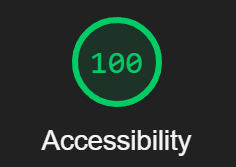

Here is my submission for the coding challenge. These are the basic commands and some notes I wanted to leave you:

**Start guide**

```
npm i
ng serve
```

**Tests**

```
ng test
```



1. All requirements are accounted for; Stories 1-3.
2. The only additional package added is Tailwind. I added custom classes for the provided color pallete.
3. Since one of the statements was:

   > We are a Typescript-first shop and value your
   > understanding of TS/JS over using specific Angular patterns.

   I didn't focus much on the Angular patterns.

4. The only test I added that seemed worth while for this task was to test if a policy number was valid. Also assumed all csv files would be in proper format.
5. Accessibility score of 100
6. Mobile responsive
7. Included a 2.2 mb File to test the file size requirement.
